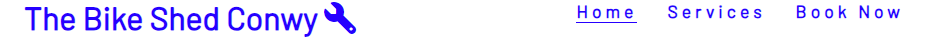
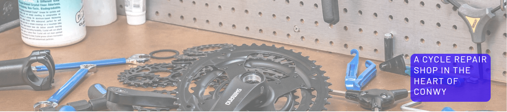
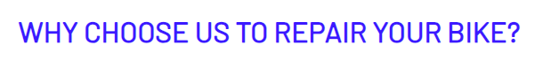
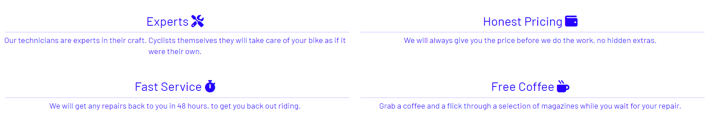
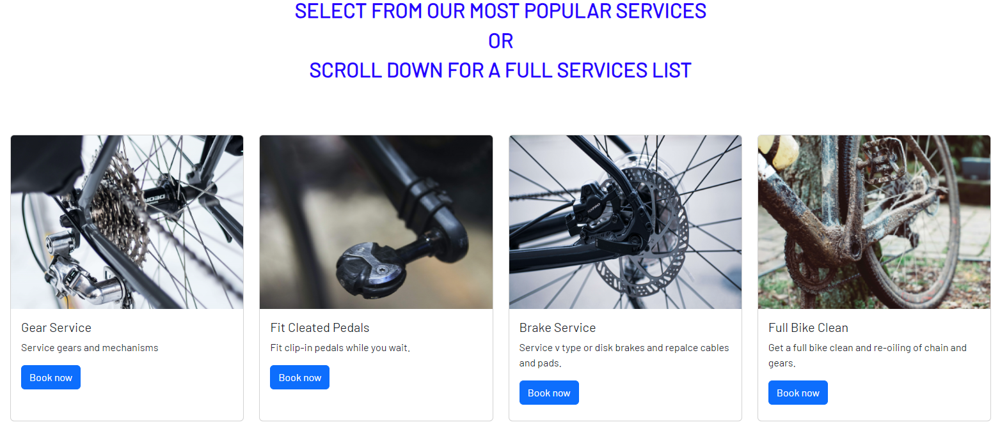

Welcome,

This is the Code Institute student template for Codeanywhere. We have preinstalled all of the tools you need to get started. It's perfectly ok to use this template as the basis for your project submissions.

You can safely delete this README.md file, or change it for your own project. Please do read it at least once, though! It contains some important information about Codeanywhere and the extensions we use. Some of this information has been updated since the video content was created. The last update to this file was: **March 3rd, 2023**

## Codeanywhere Reminders

To run a frontend (HTML, CSS, Javascript only) application in Codeanywhere, in the terminal, type:

`python3 -m http.server`

A button should appear to click: _Open Preview_ or _Open Browser_.

To run a frontend (HTML, CSS, Javascript only) application in Codeanywhere with no-cache, you can use this alias for `python3 -m http.server`.

`http_server`

To run a backend Python file, type `python3 app.py`, if your Python file is named `app.py` of course.

A button should appear to click: _Open Preview_ or _Open Browser_.

In Codeanywhere you have superuser security privileges by default. Therefore you do not need to use the `sudo` (superuser do) command in the bash terminal in any of the lessons.

To log into the Heroku toolbelt CLI:

1. Log in to your Heroku account and go to _Account Settings_ in the menu under your avatar.
2. Scroll down to the _API Key_ and click _Reveal_
3. Copy the key
4. In Codeanywhere, from the terminal, run `heroku_config`
5. Paste in your API key when asked

You can now use the `heroku` CLI program - try running `heroku apps` to confirm it works. This API key is unique and private to you so do not share it. If you accidentally make it public then you can create a new one with _Regenerate API Key_.

---

Happy coding!

# Conwy Bikes

## Milestone Projevct 1 - User-Centric Frontend Development

Welcome,

This is the Code Institute student template for Codeanywhere. We have preinstalled all of the tools you need to get started. It's perfectly ok to use this template as the basis for your project submissions.

You can safely delete this README.md file, or change it for your own project. Please do read it at least once, though! It contains some important information about Codeanywhere and the extensions we use. Some of this information has been updated since the video content was created. The last update to this file was: **March 3rd, 2023**

## Codeanywhere Reminders

To run a frontend (HTML, CSS, Javascript only) application in Codeanywhere, in the terminal, type:

`python3 -m http.server`

A button should appear to click: _Open Preview_ or _Open Browser_.

To run a frontend (HTML, CSS, Javascript only) application in Codeanywhere with no-cache, you can use this alias for `python3 -m http.server`.

`http_server`

To run a backend Python file, type `python3 app.py`, if your Python file is named `app.py` of course.

A button should appear to click: _Open Preview_ or _Open Browser_.

In Codeanywhere you have superuser security privileges by default. Therefore you do not need to use the `sudo` (superuser do) command in the bash terminal in any of the lessons.

To log into the Heroku toolbelt CLI:

1. Log in to your Heroku account and go to _Account Settings_ in the menu under your avatar.
2. Scroll down to the _API Key_ and click _Reveal_
3. Copy the key
4. In Codeanywhere, from the terminal, run `heroku_config`
5. Paste in your API key when asked

You can now use the `heroku` CLI program - try running `heroku apps` to confirm it works. This API key is unique and private to you so do not share it. If you accidentally make it public then you can create a new one with _Regenerate API Key_.

---

Happy coding!

# The Conwy Bike Hub

<h1 align="center"> The Conwy Bike Hub</h1>

[View the live project here](https://)

Conwy Bike Hub is a site that advertises a fictional bicycle repair shop. The shop provides a range of bicycle repair and maintenence services. The site is targeted to bicycle owners that require a repair and need a reliable service. The workshop has a waiting area allowing customers to relax whilst they wait for their repair and enjoy free coffee. The main USP is the locality to Conwy, a relaible and honest service and affordable pricing. The site will be useful for customers to find the range of services available, the prices and where the wqorkshop is located.  

## Index - Table of Contents

* [List of Features](#list-of-features)
* [User Experience (UX)](#user-experiences-ux)
* [Design](#design)
* [Technologies Used](#technologies-used)
* [Testing](#testing)
* [Deployment](#deployment)
* [Credits](#credits)

## List of Features

### Existing Features

* **F01 Navigation Bar**

  * The navigation bar is placed on all four pages of the website and provide a consistent look. It includes a simple logo and links to the respective pages, Home, Services, Book Now and Contact. It is responsive on multiple screen sizes and when on smaller screens they page links move under the logo.
  
    

* **F02 Landing Page**

  * The landing area includes a photograph and a text overlay that clearly identifies to the user the type of business and the service it provides. The colours are clear and not overbearing. The blue colour scheme instils a sense of security, reliability and confidence.

    

* **F03 Reasons Title**

  * The "Why choose us to reapir your bike" title leads the user to a section of positive attributes of the company and develops confidence for the prospective customer.
  
    

* **F04 Reasons Section**
    * The "reasons" sectio allows the user to learn more about the business especially its mechanic's expertise, the honest princing, the speedy service and friendly atmosphere of its workshop.
  
        

* **F05 Footer**
    * The footer is featured on every page and provides consistency across the site The footer contains links to the company's social media sites through the respective icons encouraging the user to stay connected. The business can use these sites to share promotions, update customers new services offered and further promote the business. The links attahced to these icons open in a new tab to allow for easy navigation. (As the Conwy Bike Hub is fictitious, they currenlty only lead to the social media main sites.)

        

* **F06 Popular Services**
    * The "Popular Services" section on the Services page give the user quick acccess to these particular services and a link to book them. Styling has been kept simple to ensure the user has clear information, for readibility and to minimise distraction.
  
        

* **F07 Full Service List**
    * The fulls ervice list lies below the popular service section and allows users to scroll the full range of services on offer.The are presented in a clear ta
## User Experience (UX)

### User stories
  
#### A. First Time Visitor Goals

   1. As a First Time Visitor, I want to easily understand the main purpose of the site and learn more about the organisation.
   2. As a First Time Visitor, I want to be able to easily navigate throughout the site to find content.
   3. As a First Time Visitor, I want to be able to easily navigate to and view a menu of repairs or services.
   4. As a First Time Visitor, I want to be able to easily find where the organisation is located.

#### B. Returning Visitor Goals

   1. As a Returning Visitor, I want to be able to access and view the list of services quickly and easily.
   2. As a Returning Visitor, I want to be able to check opening times quickly and easily.
   3. As a Returning Visitor, I want to be able to contact the organisation to give feedback or ask questions.

#### C. Frequent User Goals

   1. As a Frequent User, I want to be able to book the same or different services again.

## Design

## Technologies Used

## Testing

On HTML validator error received a ref cannot be used i button (img). Researched on stack overflow, now link inside button inside form. 

## Deployment

## Credits

Images-
Photo by <a href="https://unsplash.com/@tower_electric_bikes?utm_source=unsplash&utm_medium=referral&utm_content=creditCopyText">Tower Electric Bikes</a> on <a href="https://unsplash.com/s/photos/bike-wheel?orientation=landscape&license=free&utm_source=unsplash&utm_medium=referral&utm_content=creditCopyText">Unsplash</a>
  

[Colour Theory](https://www.adobe.com/creativecloud/design/hub/guides/meaning-of-blue-in-design)
## Milestone Project 1 - User-Centric Frontend Development
