# The Conwy Bike Hub

[View the live project here](https://paddyw11.github.io/CI-MSP-1-PW/)

Conwy Bike Hub is a site that advertises a fictional bicycle repair shop. The shop provides a range of bicycle repair and maintenance services. The site is targeted to bicycle owners that require a repair and need a reliable service. The workshop has a waiting area allowing customers to relax whilst they wait for their repair and enjoy free coffee. The main USP is the locality to Conwy, a reliable and honest service and affordable pricing. The site will be useful for customers to find the range of services available, the prices and where the workshop is located.  

## Index - Table of Contents

* [User Experience (UX)](#user-experience-ux)
* [List of Features](#list-of-features)
* [Design](#design)
* [Technologies Used](#technologies-used)
* [Testing](#testing)
* [Deployment](#deployment)
* [Credits](#credits)

## User Experience (UX)

### Site Goals

The goal of the Bike Shed Conwy is to inform users of its bicycle repair and maintenence services. The site should be easy to navigate and provide clear and consise information on the services it offers.

### User stories
  
#### A. First Time Visitor Goals

   1. As a First Time Visitor, I want to easily understand the main purpose of the site and learn more about the organisation.
   2. As a First Time Visitor, I want to be able to easily navigate throughout the site to find content.
   3. As a First Time Visitor, I want to be able to easily navigate to and view a menu of repairs or services.
   4. As a First Time Visitor, I want to be able to easily find where the organisation is located.

#### B. Returning Visitor Goals

   1. As a Returning Visitor, I want to be able to access and view the list of services quickly and easily.
   2. As a Returning Visitor, I want to be able to check opening times quickly and easily.
   3. As a Returning Visitor, I want to be able to contact the organisation to give feedback or ask questions.

#### C. Frequent User Goals

   1. As a Frequent User, I want to be able to book the same or different services again.

## List of Features

### Existing Features

* **F01 Navigation Bar**

  * The navigation bar is placed on all four pages of the website and provide a consistent look. It includes a simple logo and links to the respective pages, Home, Services, Book Now and Contact. It is responsive on multiple screen sizes and when on smaller screens they page links move under the logo.
  
    

* **F02 Landing Page**

  * The landing area includes a photograph and a text overlay that clearly identifies to the user the type of business and the service it provides. The colours are clear and not overbearing. The blue colour scheme instils a sense of security, reliability and confidence.

    

* **F03 Reasons Title**

  * The "Why choose us to repair your bike" title leads the user to a section of positive attributes of the company and develops confidence for the prospective customer.
  
    

* **F04 Reasons Section**

  * The "reasons" section allows the user to learn more about the business especially its mechanic's expertise, the honest pricing, the speedy service and friendly atmosphere of its workshop.
  
    

* **F05 Footer**

  * The footer is featured on every page and provides consistency across the site The footer contains links to the company's social media sites through the respective icons encouraging the user to stay connected. The business can use these sites to share promotions, update customers new services offered and further promote the business. The links attatched to these icons open in a new tab to allow for easy navigation. (As the Conwy Bike Hub is fictitious, they currently only lead to the social media main sites.)

    

* **F06 Popular Services**

  * The "Popular Services" section on the Services page gives the user quick access to these particular services and a link to book them. Styling has been kept simple to ensure the user has clear information, for readability and to minimise distraction.
  
    

* **F07 Full Service List**

  * The full service list lies below the popular service section and allows users to scroll the full range of services on offer. They are presented in a clear table with clickable links to direct the user to the booking page.
  
    

* **F08 Booking Form**

  * The booking form provides a clear booking request requiring simple details in a clearly labelled format. The form will insist on information being inserted 'required' and inserted correctly 'input restriction'.

    

* **F09 Contact Page**

  * The contact page provides information on where the company is located and uses an embedded Google Map with the location pinned. The page also includes a phone number, an e-mail address and a list of opening hours with an invitation to come in to the workshop for a chat and a coffee.
  
    

* **How these features support the User Stories**
  * The User Stories in the [User Experience (UX)](#user-experience-ux) part of this document are numbered and categorised into groups A(first time visitor), B (returning visitor) and C (frequent visitor). The existing features are listed above as F01 to F09. Below is a traceability matrix which cross references the user stories and the features, highlighting where the features support the stories:

    

### Future features

* **Nav Bar Updates**
  * A hamburger menu could be implemented to allow for cleaner navigation on smaller screens.
  * The navigation bar could be made 'sticky' to keep it at the top of the screen.
* **More Info Areas**
  * A 'More info' button could be added to the services list to describe in more detail what is included in each service. The information could be displayed in a modal or tool tip feature.
* **Cart and checkout for bookings**
  * A 'shopping cart' could be utilised for customers purchasing more than one service and a checkout could confirm a booking for service(s).

## Design

### Imagery

* The hero image and services images have been chosen as they portray the purpose of the business and highlight the specific bike parts that are serviced. The hero image of the workshop shows the nature of the business as a whole and the service pictures help the user associate with their particular need.

### Colour

* The colour of 'dark saturated blue/vivid navy' (#2600ff) has been chosen for its association with confidence, reliability and security, three attribures required for bike mechanics and repair.
*Due to the poor colour contrast of black on blue, white has been used for font over blue. The footer bar is black (#000000) with a grey (#777777) used for the Social Media icons.  

### Typography

 was used to choose a font-family.
 was selected as a readable and clear font.
 icons were used throughout the site, such as on the 'reasons' area and the social media icons in the footer.

### Wireframes

To follow best practice, wireframes have been developed for mobile tablet and desktop sizes. [Balsamiq](https://balsamiq.com/wirefrmmes) to create the wireframes.

#### Home Page

* Mobile 
* Tablet 
* Desktop 

#### Services Page

* Mobile 
* Tablet 
* Desktop 

#### Book Now Page

* Mobile 
* Tablet 
* Desktop 

#### Contact Page

* Mobile 
* Tablet 
* Desktop 

## Technologies Used

### Languages used

* [HTML5](https://en.wikipedia.org/wiki/HTML5)
* [CSS](https://en.wikipedia.org/wiki/CSS)

### Frameworks, Libraries and Programs Used

* [Google Fonts](https://fonts.google.com/) was used to import the 'Barlow' font family into the style.css file. This font is used on every page of the site.
* [Font Awesome](https://fontawesome.com/) was used to add icons for aesthetic purpose and UX design.
* [Bootstrap](https://getbootstrap.com/) was used as a front-end external CSS framework for modern responsiveness and pre-built components.
* [Fonticon](https://gauger.io/fonticon/) was used to create the favicon.
* [Balsamiq](https://balsamiq.com/) was used to create the wireframes during the design stages.
* [CodeAnywhere](https://codeanywhere.com/) was used as an IDE and to commit and push to Github.
* [Github](https://github.com/) is used as a repository for the project code after being pushed from Codeanywhere.
* [Microsoft Paint 3D](https://apps.microsoft.com/store/detail/paint-3d/9NBLGGH5FV99) was used for re-sizing images.
* [Am I Responsive](https://ui.dev/amiresponsive) was used to create the multi-device responsiveness image.
  
## Testing

### Code Validation

#### HTML

I have used the recommended [HTML Validator](https://validator.w3.org) to validate all of my HTML files.

* Result for index.html
  * 
  * Result for services.html
  * 
  * Result for booknow.html
  * 
  * Result for contact.html
  * 

* Full validation is available here:
  * [Index Page](documentation/validation-results/html-validator-index.pdf)
  * [Services Page](documentation/validation-results/html-validator-services.pdf)
  * [Book Now Page](documentation/validation-results/html-validator-booknow.pdf)
  * [Contact Page](documentation/validation-results/html-validator-contact.pdf)
  
#### CSS

I have used the recommended [CSS Jigsaw Validator](https://jigsaw.w3.org/css-validator/) to validate my CSS files.

* Result for style.css

  * 

### Browser Compatibility

I've tested my deployed project on multiple browsers to check for compatibility issues.
| Browser | Screenshot | Notes |
| --- | --- | --- |
| Chrome | 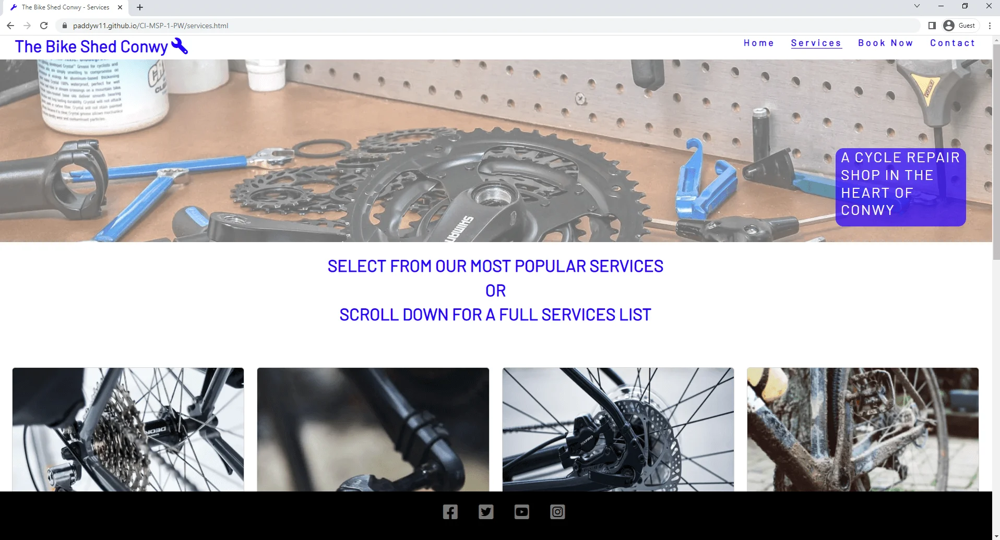 | Works as expected |
| Firefox | 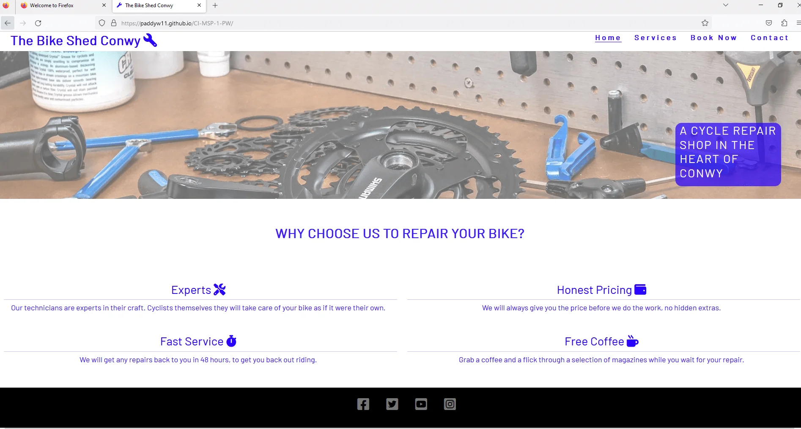 | Works as expected |
| Edge | 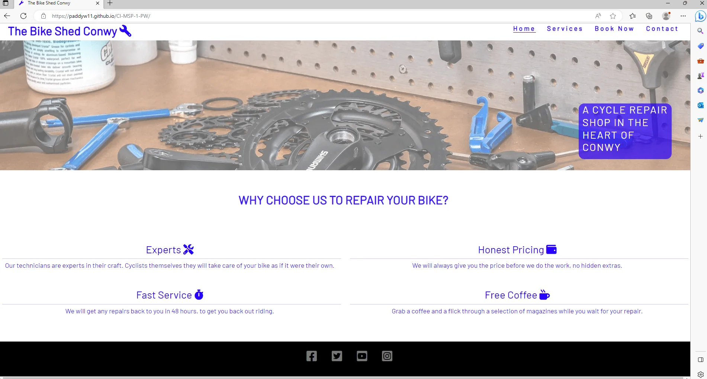 | Works as expected |
| Opera | 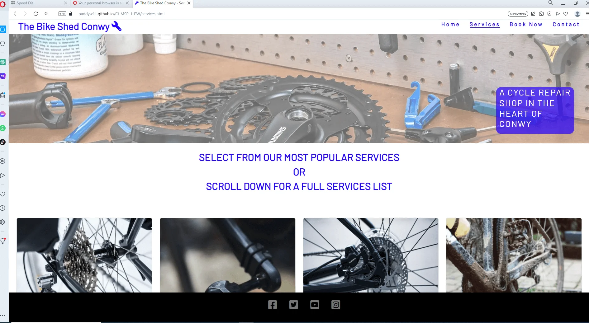 | Works as expected |
| Internet Explorer | 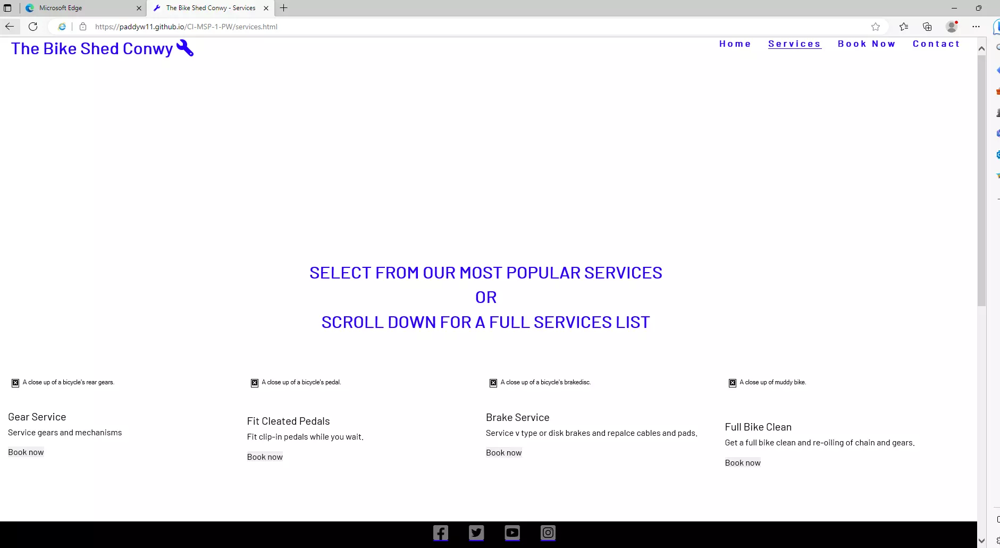 | Does not work as expected as IE does not support webp image format or Bootstrap |

### Responsiveness

I've tested my deployed project on multiple devices to check for responsiveness issues.

| Device | Screenshot Home | Screenshot Services | Screenshot Book Now | Screenshot Contact | Notes |
| --- | --- | --- | --- | --- | --- |
| Medium Mobile (DevTools) | 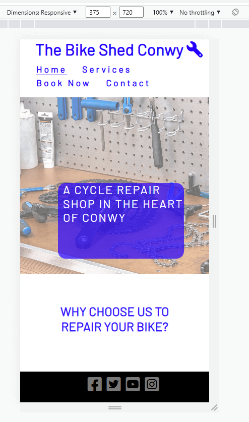 | 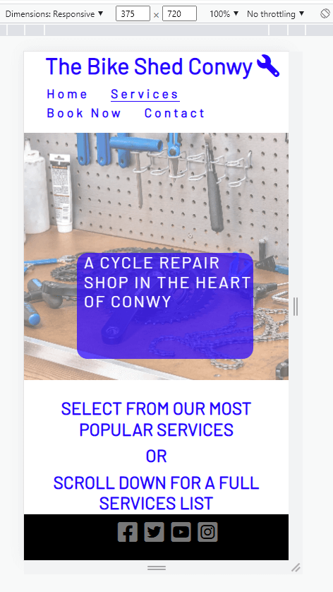 | 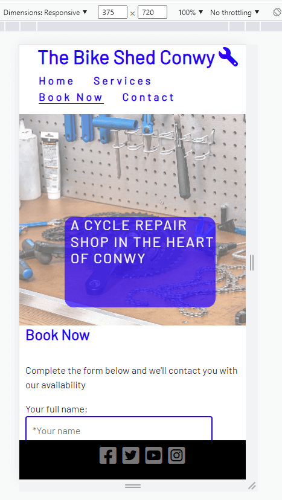 | 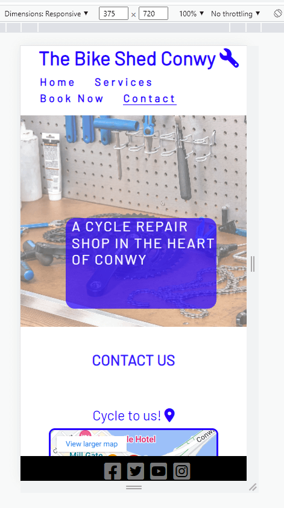 | Works as expected |
| Tablet (DevTools) | 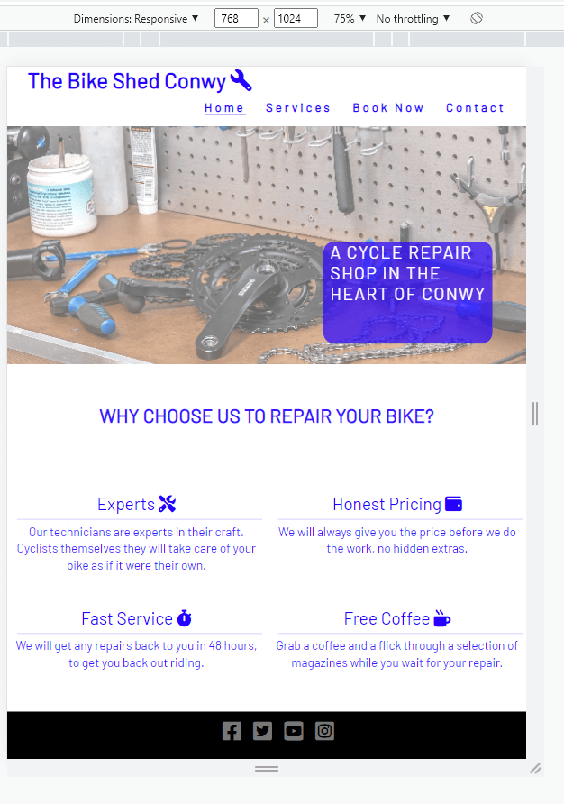 | 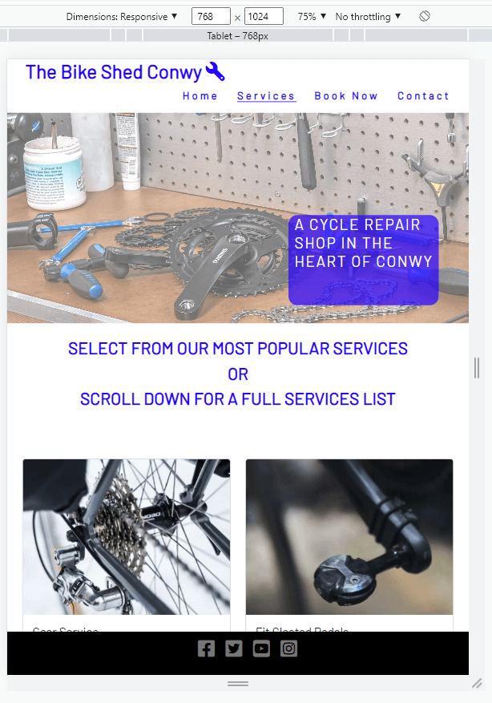 | 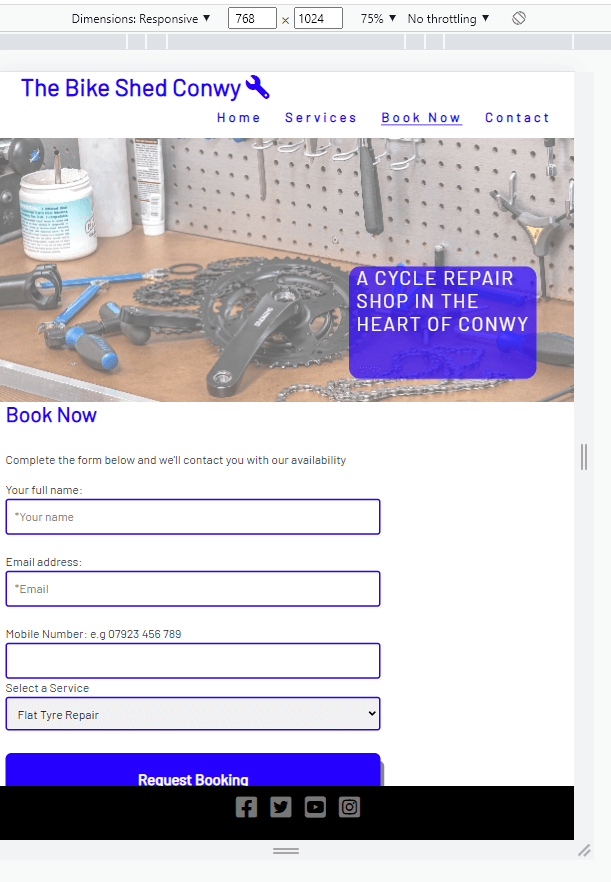 | 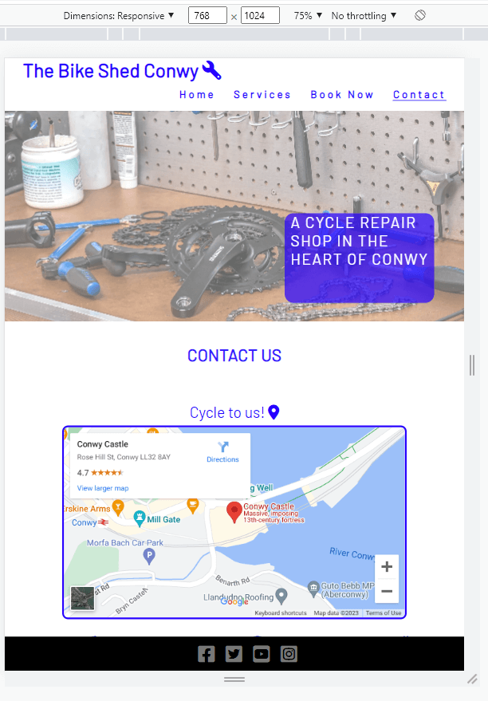 | Works as expected |
| Laptop (DevTools) | 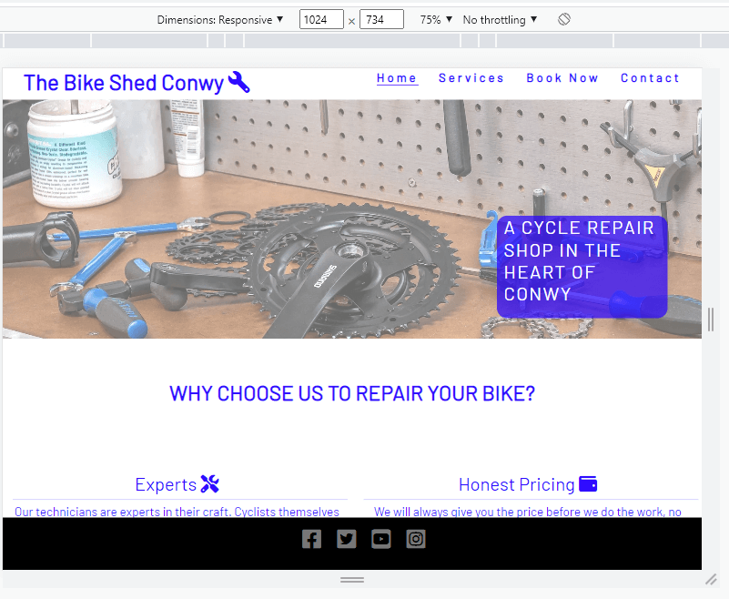 | 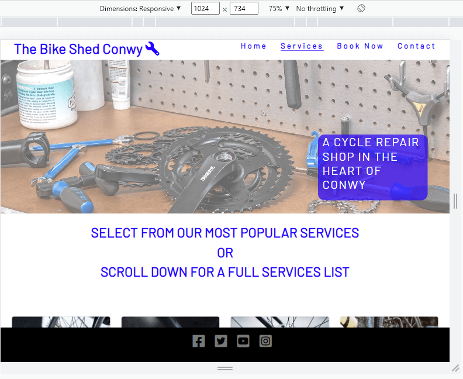 | 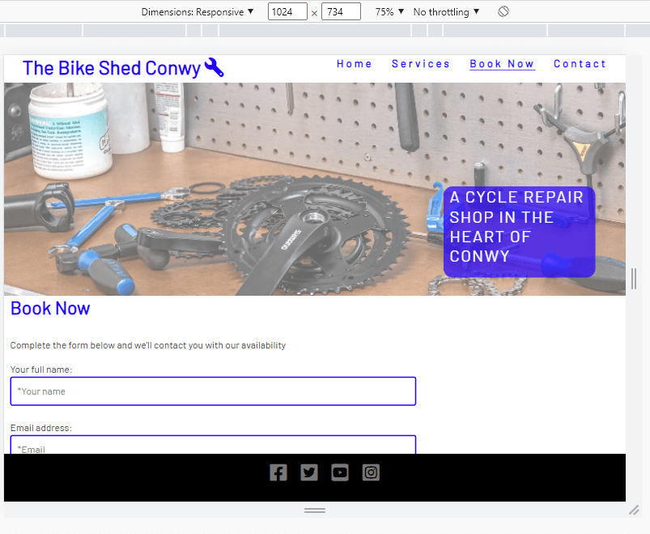 | 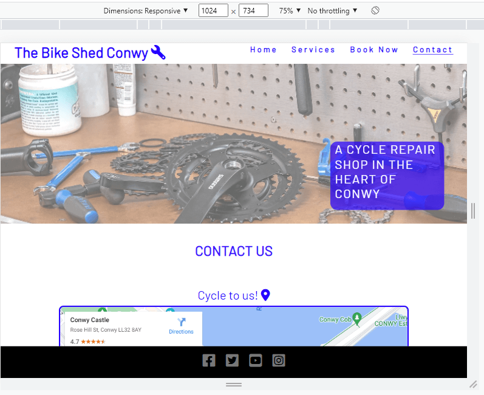 | Works as expected |
| Desktop |  | 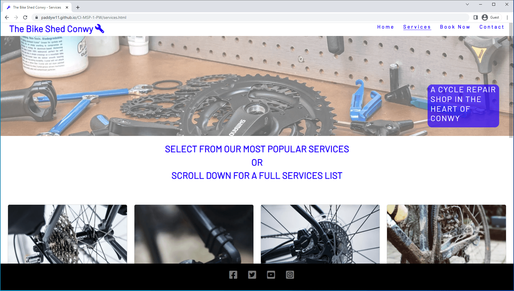 | 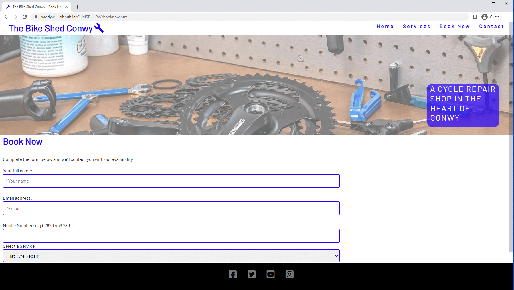 | 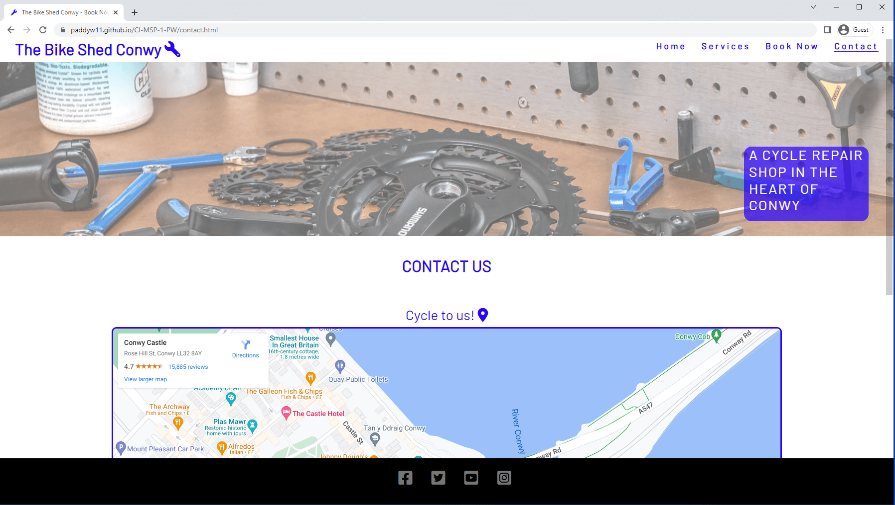 | Works as expected |

### Feature testing

    * The following table details the testing of site navigation, form action and validation and responsiveness functionality. The testing cross-references to the features listed above.
  
    

### Bugs

During a HTML validation test, an error was received regarding a ref cannot be used in buttons [a-ref button issue](documentation/validation-results/W3-Validator-HTML-Index-a-ref-btn-issue.png).
I researched on [Stack Overflow](https://stackoverflow.com/questions/24837102/the-element-button-must-not-appear-as-a-descendant-of-the-a-element) to fix.

During testing a CSS styling issue meant the cards were a different height due to text wrap dropping a line. I put a 'min-height' style in pace to rectify.
[screenshot](documentation/validation-results/card-body-height-issue.png)

## Deployment

## Credits

### Content

* The content on the services page was loosely based on list of services on [WECycle](https://www.wecycle.co.uk/pages/workshop/)
* The card element for displaying the popular services was inspired at [BikeRepairs4U](https://www.bikerepairs4u.com/services)

### Media

* The icons used throughout the site were taken from [Font Awesome](https://fontawesome.com/)
* The fonts were imported from [Google Fonts](https"//fonts.google.com/)

* All images were downloaded from [UnSplash](https://unsplash.com/)
* [Rear Gear Image](https://unsplash.com/photos/ZKB9Bo4zCqQ) by [Andrew Seaman](https://unsplash.com/@amseaman)
* [Workbench Image](https://unsplash.com/photos/A7Qi_0oqOqA) by [Tom Conway](https://unsplash.com/@tecreate)
* [Pedal Image](https://unsplash.com/photos/NPkCLzrXmVE) by [Taylor Smith](https://unsplash.com/@whoistaylorsmith)
* [Brake Disk Image](https://unsplash.com/photos/rERWRZQPA9A) by [선인장](https://unsplash.com/@mustachescactus)

[Colour Theory](https://www.adobe.com/creativecloud/design/hub/guides/meaning-of-blue-in-design)

### Acknowledgements

* I would like to thank:
  * My Code Institute Mentor and Cohort Supervisor, [Elaine Broche](https://github.com/elainebroche-dev) and [Iris Smok](https://www.linkedin.com/in/irissmok/) respectively who have provided great advice and feedback on how to plan and execute this project.
  * Danny Walsh and James Walsh for their late-night Git Hub advice and site feedback.
  * Finally, Kim Dodd on her UX prowess.
  